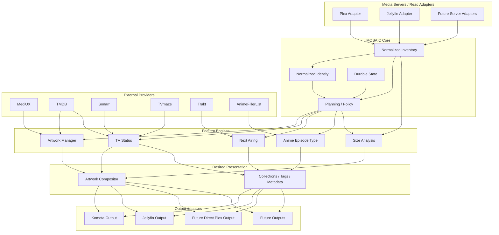

# MOSAIC 4.0 Architecture Overview

**MOSAIC** — **M**edia **O**rchestration, **S**ynchronization, **A**rtwork, **I**dentity & **C**ollections

> **Your media library, orchestrated.**

## Purpose

MOSAIC 4.0 evolves DAKOSYS from a Plex/Kometa-oriented companion application into a media-server-neutral orchestration platform.

MOSAIC ingests authoritative library state from one or more media servers, enriches that state with metadata and artwork providers, applies deterministic planning and policy logic, and emits results through one or more output targets.

The architecture preserves the strongest properties of DAKOSYS 3.x: deterministic planning, reviewed apply workflows, fail-closed safety, durable state and audit history, artwork cohesion, conservative matching, provider fallback, automation, scheduling, and the web dashboard.

## Architectural principles

1. **Core logic is media-server-neutral.** Core modules must not directly depend on Plex, Jellyfin, Kometa, or another platform's object model.
2. **Reads and writes are separate concerns.** Media-server adapters read authoritative library state; output adapters apply desired state.
3. **Providers supply facts and assets.** TMDB, MediUX, Sonarr, TVmaze, Trakt, AnimeFillerList, and similar integrations do not decide how results are represented on a target platform.
4. **Feature engines operate on normalized models.** Artwork, TV status, next airing, anime episode classification, and size analysis share normalized identities and inventory.
5. **Presentation is derived state.** Overlays, title cards, composite artwork, collections, and tags are generated from authoritative source state and policy.
6. **Safety remains first-class.** Unknown ownership, stale plans, manual changes, invalid source images, and ambiguous identity fail closed rather than trigger guesses.

> **Core code knows about media, not Plex, Jellyfin, or Kometa. Platform-specific behavior belongs behind adapters.**

## High-level architecture



## Runtime flow

```mermaid
flowchart LR
    A["Scan media server(s)"] --> B["Build normalized inventory"]
    B --> C["Resolve identities"]
    C --> D["Enrich from providers"]
    D --> E["Run feature engines"]
    E --> F["Build desired-state plan"]
    F --> G["Validate ownership / safety / staleness"]
    G --> H["Render derived presentation"]
    H --> I["Apply through output adapters"]
    I --> J["Persist state and audit history"]
```



## Proposed package boundaries

```text
mosaic/
├── core/
│   ├── identity/
│   ├── inventory/
│   ├── models/
│   ├── planning/
│   ├── policy/
│   └── state/
├── servers/
│   ├── base.py
│   ├── plex/
│   └── jellyfin/
├── providers/
│   ├── mediux/
│   ├── tmdb/
│   ├── sonarr/
│   ├── tvmaze/
│   ├── trakt/
│   └── anime_filler_list/
├── features/
│   ├── artwork/
│   ├── tv_status/
│   ├── next_airing/
│   ├── anime_episode_type/
│   └── size/
├── presentation/
│   ├── compositor/
│   ├── collections/
│   └── metadata/
├── outputs/
│   ├── kometa/
│   ├── jellyfin/
│   └── plex/
├── scheduler/
├── notifications/
└── web/
```

## Normalized identity

MOSAIC must not use a Plex rating key as a universal identity. A normalized server identity should contain at least:

```python
MediaItemIdentity(
    server_type="plex" | "jellyfin" | "...",
    server_instance_id="configured-server-name",
    server_item_id="platform-specific-stable-id",
)
```

External provider IDs remain separate matching evidence:

```python
ExternalIds(tmdb=None, tvdb=None, imdb=None)
```

Plex and Jellyfin items should be matched primarily using stable external provider IDs. Filesystem paths may be secondary evidence where both servers read the same media. Title fuzziness must not be the primary automatic identity mechanism.

## Media-server adapters

A read adapter should expose normalized capabilities such as:

```python
class MediaServer:
    def list_libraries(self): ...
    def list_movies(self, library_id): ...
    def list_shows(self, library_id): ...
    def list_seasons(self, show_id): ...
    def list_episodes(self, show_id): ...
    def get_item(self, item_id): ...
    def get_external_ids(self, item_id): ...
    def get_media_sources(self, item_id): ...
    def get_image_info(self, item_id, image_type): ...
    def get_image(self, item_id, image_type): ...
```

Mutation methods belong behind output capabilities rather than being assumed by the read adapter.

### Initial adapters

**Plex:** preserve current behavior while translating Plex objects into normalized MOSAIC models.

**Jellyfin:** initially read-only; support library discovery, movies/shows/seasons/episodes, server item IDs, TMDB/TVDB/IMDb IDs, image information, media sources, and size information.

## Output adapters

**Kometa** remains supported, but YAML-generation behavior moves behind an output boundary rather than defining the core model.

**Jellyfin** becomes the first native non-Kometa output. Expected capabilities include artwork application, collection synchronization, supported metadata/tags, and ownership evidence, all gated by MOSAIC safety validation.

## Feature portability

### Artwork Manager

Reuse MediUX/TMDB providers, generated episode cards, candidate selection, cohesion, validation, fingerprinting, quarantine, reviewed planning, state, and run history. Replace/isolate Plex inventory extraction, Kometa emission, Plex-specific identity, and final application.

### TV Status

Reuse the provider resolver, lifecycle and next-episode precedence, provider fallback, and dashboard representation. Replace/isolate Plex GUID extraction and Kometa-specific presentation.

### Next Airing

Reuse provider-independent next-airing models, ordering, and dashboard. Add a Jellyfin-native collection writer.

### Size Analysis

Reuse history, reporting, and aggregation. Replace/isolate Plex media-part extraction and Kometa overlay emission.

### Anime Episode Type

Reuse AnimeFillerList classification, conservative mapping, and diagnostics. Replace/isolate Plex episode targeting and Kometa `tvdb_episode` output.

## Jellyfin artwork ownership

Initial design: ownership witnessing.

1. MOSAIC applies an image.
2. MOSAIC records the resulting server-side image identity/tag.
3. A later scan compares the current identity/tag with the recorded value.
4. Match means MOSAIC may still own the derivative.
5. Mismatch means an external/manual change is assumed.
6. External/manual change fails closed until reviewed.

This must be validated experimentally before native Artwork Manager writes are enabled.

## Native compositor

MOSAIC must never recursively bake transforms onto an already-rendered derivative.

```text
AUTHORITATIVE BASE ART
    MediUX / TMDB / manual source
        |
        v
TRANSFORM LAYERS
    TV Status / Size / future annotations
        |
        v
DETERMINISTIC DERIVATIVE
        |
        v
OUTPUT ADAPTER
    Jellyfin / Kometa / future
```

The system must retain enough state to distinguish base artwork, transform configuration, generated derivative, and currently applied derivative.

## Dual-server migration mode

MOSAIC 4.0 should explicitly support a period where Plex and Jellyfin coexist.

```yaml
media_servers:
  plex:
    type: plex
    enabled: true
    url: ...
    token: ...

  jellyfin:
    type: jellyfin
    enabled: true
    url: ...
    api_key: ...

primary_media_server: jellyfin
```

Exact configuration is deferred until the adapter contracts are implemented.

## Plex ↔ Jellyfin parity audit

Before native writes, MOSAIC should report library counts, matched/unmatched movies and shows, season/episode parity, missing/conflicting provider IDs, path differences where useful, and items requiring manual review. Matching should favor external IDs over title similarity.

## Delivery phases

### Phase 1 — Foundation
- publish architecture and MOSAIC terminology;
- define normalized core models;
- define media-server and output interfaces;
- adapt existing Plex behavior without regression.

### Phase 2 — Jellyfin read path
- implement read-only Jellyfin adapter;
- normalize IDs, media sources, and image state;
- implement Plex ↔ Jellyfin parity audit.

### Phase 3 — First native Jellyfin feature
- port TV Status onto normalized identities;
- implement Jellyfin collection output;
- implement native Next Airing;
- expose results in the dashboard.

### Phase 4 — Artwork Manager on Jellyfin
- validate ownership/manual-change detection;
- reuse current Artwork Manager decision logic;
- apply images directly to Jellyfin;
- retain reviewed/manual apply initially.

### Phase 5 — Native presentation engine
- implement the deterministic compositor;
- support TV Status and Size transforms;
- never recursively re-bake derivatives.

### Phase 6 — Anime Episode Type
- map AFL classifications to normalized/Jellyfin episode IDs;
- select a Jellyfin-native presentation strategy;
- implement reviewed output.

## Initial scope

### In scope
- preserve Plex/Kometa behavior;
- introduce media-server-neutral abstractions;
- add read-only Jellyfin inventory;
- support dual-server migration;
- deliver a native Jellyfin feature path;
- retain reviewed/fail-closed safety semantics.

### Out of scope for the first milestone
- removing Plex;
- removing Kometa;
- rewriting MOSAIC as a Jellyfin plugin;
- complete feature parity on day one;
- unsafe automatic artwork replacement;
- title-only cross-server matching;
- breaking 3.x installations without migration support.

## Definition of architectural success

The architecture succeeds when:

1. a feature engine can operate without importing Plex, Jellyfin, or Kometa APIs;
2. Plex and Jellyfin independently produce the same normalized domain models;
3. desired state can be emitted through more than one output adapter;
4. current Plex/Kometa workflows continue during migration;
5. Jellyfin-native features can be added without duplicating decision logic; and
6. manual changes and ambiguous state continue to fail closed.
